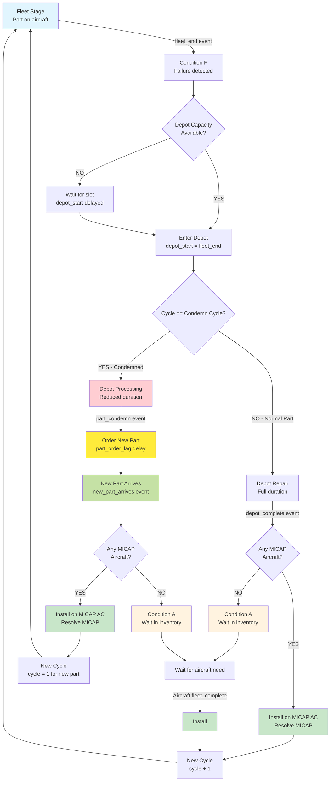
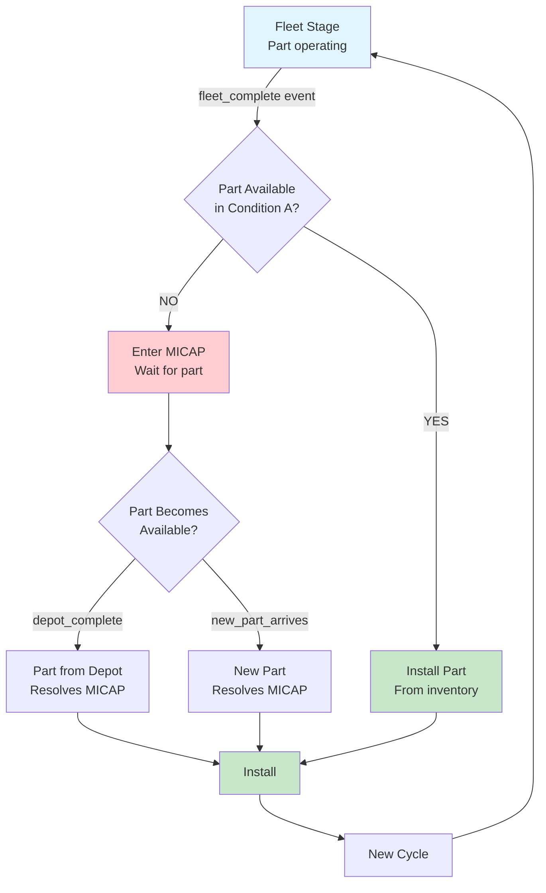
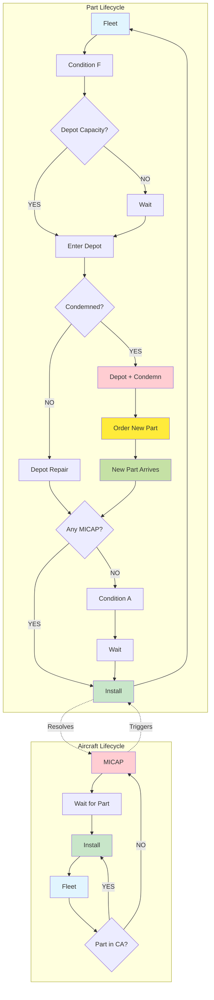

# Simulation Flow Diagrams

testing 1 

This document shows the business logic flow of the aircraft parts simulation system, which tracks two interconnected lifecycles: **Part Lifecycle** and **Aircraft Lifecycle**.

## System Overview

The simulation tracks two interconnected lifecycles that work together to model aircraft maintenance and parts availability:

- **Part Lifecycle**: Tracks parts from operation through maintenance back to availability
- **Aircraft Lifecycle**: Tracks aircraft from operation through MICAP (Mission Capability) status

## Part Lifecycle Flow



**Key Points:**
- Depot capacity is checked **first** when part enters Condition F
- Condemn decision is made **after depot_start is determined** based on `cycle == condemn_cycle`
- Condemned parts use reduced depot time (`depot_duration * condemn_depot_fraction`)
- The **old condemned part's lifecycle ends** at `part_condemn` event
- A **new replacement part** is created with `cycle=0` and arrives after `part_order_lag`

## Aircraft Lifecycle Flow



## Combined System Flow (Simplified)



## Event Types and Flow

### Main Event Loop Events

| Event | Handler | Trigger |
|-------|---------|---------|
| `fleet_complete` | `handle_aircraft_needs_part()` | Aircraft completes fleet stage |
| `depot_complete` | `handle_part_completes_depot()` | Normal part completes repair |
| `new_part_arrives` | `handle_new_part_arrives()` | Replacement part arrives |
| `part_fleet_end` | `event_p_cfs_de()` | Part's fleet stage ends, enters CF→Depot flow |
| `CF_DE` | `event_cf_de()` | Part moves from Condition F to Depot |
| `part_condemn` | `event_p_condemn()` | Condemned part triggers new part order |

### Event Flow by Scenario

**Normal Part Completes Depot (No MICAP):**
```
depot_complete → handle_part_completes_depot() → Part to Condition A
```

**Normal Part Completes Depot (MICAP exists):**
```
depot_complete → handle_part_completes_depot() → Install on MICAP AC → event_acp_fs_fe() → Schedule fleet_complete + part_fleet_end
```

**Aircraft Needs Part (Available):**
```
fleet_complete → handle_aircraft_needs_part() → Take from Condition A → event_acp_fs_fe() → Schedule fleet_complete + part_fleet_end
```

**Aircraft Needs Part (None Available):**
```
fleet_complete → handle_aircraft_needs_part() → Enter MICAP queue
```

**Condemned Part:**
```
part_fleet_end → event_p_cfs_de() [depot capacity check THEN condemn check] → Schedule part_condemn
part_condemn → event_p_condemn() → Order new part → Schedule new_part_arrives
new_part_arrives → handle_new_part_arrives() → [Same as depot_complete logic]
```

## Depot Capacity Management

The depot uses a **heap-based scheduling** approach, not a waiting loop:

```python
# FIRST: Check depot capacity
if len(active_depot) < depot_capacity:
    depot_start = fleet_end  # Start immediately
else:
    earliest_free = heapq.heappop(active_depot)
    depot_start = max(fleet_end, earliest_free)  # Start when slot opens

# THEN: Check condemn cycle
if cycle == condemn_cycle:
    # Condemned path...
else:
    # Normal path...
```

- Parts don't "wait in a queue" - their `depot_start` time is calculated based on when capacity becomes available
- The `active_depot` heap tracks when each depot slot will free up
- Condition F duration = `depot_start - fleet_end` (waiting time, can be 0)
- Condemn check happens **after** depot_start is determined

## Condemnation Logic

Condemnation is **deterministic based on cycle count**, checked **after depot capacity**:

```python
# In event_p_cfs_de() - order matters!

# 1. FIRST: Calculate depot_start based on capacity
if len(self.active_depot) < self.params['depot_capacity']:
    s3_start = s1_end
else:
    earliest_free = heapq.heappop(self.active_depot)
    s3_start = max(s1_end, earliest_free)

# 2. THEN: Check condemn cycle
if cycle == params['condemn_cycle']:
    condemn = "yes"
    depot_duration = calculate_depot_duration() * condemn_depot_fraction
    schedule_event(depot_end, 'part_condemn', sim_id)
else:
    depot_duration = calculate_depot_duration()
    schedule_event(depot_end, 'depot_complete', sim_id)
```

- A part is condemned when `cycle == condemn_cycle` (e.g., condemn at cycle 5)
- Condemned parts use reduced depot time (inspection before disposal)
- At `part_condemn`, a new replacement part is ordered
- The **old part's lifecycle ends** - it is not reused
- The **new part** starts at `cycle=0`
