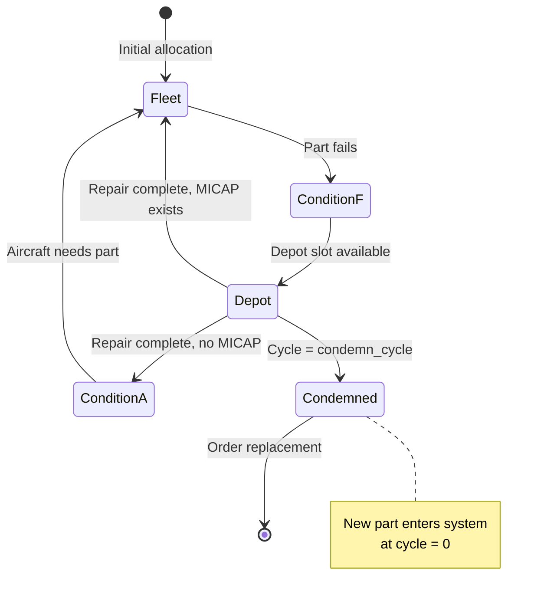

# Mathematical Specification

This document provides a formal statistical specification of the aircraft parts simulation model. It is intended for statisticians and data scientists who need to understand or reproduce the mathematical foundations.

## 1. Model Classification

| Property | Value |
|----------|-------|
| Model Type | Discrete Event Simulation (DES) |
| Time Domain | Continuous time, discrete state |
| Stochastic Structure | Two coupled renewal processes |
| State Advancement | Next-event time progression |

The simulation models two interconnected stochastic processes:

1. **Part Lifecycle**: A renewal process where parts cycle through operational and maintenance states
2. **Aircraft Lifecycle**: A dependent process where aircraft availability depends on part availability

---

## 1.5 Notation Reference

This section maps code variable names to their mathematical symbols.

### Entity Identifiers

| Variable | Symbol | Notes |
|----------|--------|-------|
| part_id | $i$ | Part index |
| ac_id | $j$ | Aircraft index |
| sim_id | $\sigma_i$ or $\text{SIM}_i$ | SIM event ID |
| des_id | $\delta_j$ or $\text{DES}_j$ | DES event ID |
| cycle | $c$ | Cycle number |

### Foreign Keys (Subscript Notation)

| Variable | Symbol | Notes |
|----------|--------|-------|
| desone_id | $\delta_{i,c}^{(1)}$ or $j_{i,c}^{(1)}$ | Aircraft at stage 1 |
| acone_id | $j_{i,c}^{(1)}$ | Aircraft at stage 1 |
| destwo_id | $\delta_{i,c}^{(4)}$ or $j_{i,c}^{(4)}$ | Aircraft at stage 4 |
| actwo_id | $j_{i,c}^{(4)}$ | Aircraft at stage 4 |
| simone_id | $\sigma_{j,c}^{(1)}$ or $i_{j,c}^{(1)}$ | Part at stage 1 |
| partone_id | $i_{j,c}^{(1)}$ | Part at stage 1 |
| simtwo_id | $\sigma_{j,c}^{(4)}$ or $i_{j,c}^{(4)}$ | Part at stage 4 |
| parttwo_id | $i_{j,c}^{(4)}$ | Part at stage 4 |

### MICAP Variables (Aircraft-centric)

| Variable | Symbol | Notes |
|----------|--------|-------|
| micap_start | $\text{micap}_j^{\text{start}}$ | Aircraft $j$ MICAP start |
| micap_end | $\text{micap}_j^{\text{end}}$ | Aircraft $j$ MICAP end |
| micap_duration | $\text{micap}_j^{\text{duration}}$ | Aircraft $j$ MICAP duration |
| micap (status) | $M_j \in \{0, 1\}$ | Binary indicator |

### Parameters

| Variable | Symbol | Notes |
|----------|--------|-------|
| sone_mean | $\mu_1$ | Stage 1 mean |
| sone_sd | $\sigma_1$ | Stage 1 SD |
| stwo_mean | $\mu_2$ | Stage 2 mean |
| stwo_sd | $\sigma_2$ | Stage 2 SD |
| sthree_mean | $\mu_3$ | Stage 3 mean |
| sthree_sd | $\sigma_3$ | Stage 3 SD |
| sfour_mean | $\mu_{4b}$ | Stage 4b mean |
| sfour_sd | $\sigma_{4b}$ | Stage 4b SD |
| n_total_parts | $N_{\text{parts}}$ | Total parts |
| n_total_aircraft | $N_{\text{aircraft}}$ | Total aircraft |
| sim_time | $t_{\text{sim}}$ | Simulation time |

---

## 2. Probability Distributions

### 2.1 Fleet Stage Duration

The time a part spends in the fleet (operational) stage is drawn from one of two distributions:

**Normal Distribution:**

$$D_{\text{fleet}} = \max(0, X) \quad \text{where } X \sim \mathcal{N}(\mu_f, \sigma_f)$$

**Weibull Distribution:**

$$D_{\text{fleet}} =  W \sim \text{Weibull}(k_f, \lambda_f)$$


Where:
- $\mu_f$ = `sone_mean` (fleet mean for Normal)
- $\sigma_f$ = `sone_sd` (fleet std dev for Normal)
- $k_f$ = `sone_mean` (shape parameter for Weibull)
- $\lambda_f$ = `sone_sd` (scale parameter for Weibull)

The $\max(0, \cdot)$ truncation ensures non-negative durations.

### 2.2 Depot Stage Duration

The time a part spends in depot repair follows the same distributional options:

**Normal Distribution:**

$$D_{\text{depot}} = \max(0, X) \quad \text{where } X \sim \mathcal{N}(\mu_d, \sigma_d)$$

**Weibull Distribution:**

$$D_{\text{depot}} = W \sim \text{Weibull}(k_d, \lambda_d)$$

Where:
- $\mu_d$ = `sthree_mean` (depot mean for Normal)
- $\sigma_d$ = `sthree_sd` (depot std dev for Normal)
- $k_d$ = `sthree_mean` (shape parameter for Weibull)
- $\lambda_d$ = `sthree_sd` (scale parameter for Weibull)

### 2.3 Condemned Part Depot Duration

Parts that reach the condemn cycle threshold use a reduced depot duration:

$$D_{\text{depot,condemn}} = D_{\text{depot}} \cdot \alpha$$

Where $\alpha$ = `condemn_depot_fraction` $\in (0, 1]$

This represents the reduced processing time for a part being disposed rather than repaired.

### 2.4 Initial Cycle Assignment

At simulation initialization, parts are assigned a random starting cycle to establish steady-state conditions:

$$C_0 \sim \text{DiscreteUniform}\{1, 2, \ldots, C_{\text{condemn}} - 1\}$$

Where $C_{\text{condemn}}$ = `condemn_cycle`

### 2.5 Optional Duration Randomization

Fleet and depot durations can be further randomized by a uniform multiplier:

$$D_{\text{randomized}} = D_{\text{base}} \cdot U$$

Where $U \sim \text{Uniform}(r_{\min}, r_{\max})$

- Fleet: `fleet_rand_min`, `fleet_rand_max` (if `use_fleet_rand` = true)
- Depot: `depot_rand_min`, `depot_rand_max` (if `use_depot_rand` = true)

---

## 3. Queue Theory and Capacity Constraints

### 3.1 Depot Capacity Constraint

The depot operates as a **capacity-constrained server** with $K$ parallel slots:

$$
t_{\text{depot,start}} = \begin{cases} 
t_{\text{ConditionF,start}} & \text{if } |A_{\text{depot}}(t)| < K \\
\max\left(t_{\text{ConditionF,start}}, \min_i \{c_i\}\right) & \text{otherwise}
\end{cases}
$$

Where:
- $K$ = `depot_capacity` (maximum concurrent repairs)
- $A_{\text{depot}}(t)$ = set of parts currently in depot at time $t$
- $c_i$ = completion time of part $i$ currently in depot

### 3.2 MICAP Queue

Aircraft waiting for parts form a **FIFO queue**:

$$\text{Service Order: } a_1, a_2, \ldots, a_n \text{ where } t_{\text{MICAP,start}}(a_1) \leq t_{\text{MICAP,start}}(a_2) \leq \cdots$$

The first aircraft to enter MICAP is the first to receive an available part.

### 3.3 Condition A Inventory

Available parts waiting for aircraft form a **FIFO queue** with secondary ordering:

$$\text{Service Order: } (t_{\text{CA,start}}, \text{part{\_}id}) \text{ lexicographically}$$

Parts are selected by earliest `condition_a_start` time, with `part_id` as tiebreaker.

---

## 4. State Space and Transitions

### 4.1 Part State Space

A part exists in one of five states:

$$S_p = \{\text{Fleet}, \text{ConditionF}, \text{Depot}, \text{ConditionA}, \text{Condemned}\}$$

| State | Description |
|-------|-------------|
| Fleet | Part is installed on aircraft, operating |
| ConditionF | Part has failed, waiting for depot slot |
| Depot | Part is undergoing repair |
| ConditionA | Part is repaired, waiting in inventory |
| Condemned | Part has been disposed (terminal state) |

### 4.2 Aircraft State Space

An aircraft exists in one of two states:

$$S_a = \{\text{Flying}, \text{MICAP}\}$$

| State | Description |
|-------|-------------|
| Flying | Aircraft is operational with installed part |
| MICAP | Aircraft is grounded, waiting for part |

### 4.3 State Transition Diagram



### 4.4 Transition Probabilities

All state transitions are **deterministic** given the current state. The stochastic element is the **duration** of each state, not the destination.

| Transition | Deterministic? | Condition |
|------------|----------------|-----------|
| Fleet → ConditionF | Yes | Always occurs when fleet duration completes |
| ConditionF → Depot | Yes | Occurs when depot slot becomes available |
| Depot → ConditionA | Yes | Occurs when repair completes and no MICAP exists |
| Depot → Fleet | Yes | Occurs when repair completes and MICAP aircraft waiting |
| ConditionA → Fleet | Yes | Occurs when aircraft enters MICAP |
| Depot → Condemned | Yes | Occurs when cycle = condemn_cycle |

**Condemnation** is deterministic based on cycle count:

$$P(\text{Condemn} | C = c) = \begin{cases} 1 & \text{if } c = C_{\text{condemn}} \\ 0 & \text{otherwise} \end{cases}$$

---

## 5. Timing Equations

### 5.1 Fleet Stage Timing

$$t_{\text{fleet,start}} = t_{\text{install,end}}$$
$$t_{\text{fleet,end}} = t_{\text{fleet,start}} + D_{\text{fleet}}$$

### 5.2 Condition F Timing (Depot Wait)

$$t_{\text{CF,start}} = t_{\text{fleet,end}}$$
$$t_{\text{CF,end}} = t_{\text{depot,start}}$$
$$D_{\text{CF}} = t_{\text{depot,start}} - t_{\text{fleet,end}}$$

The Condition F duration represents waiting time when depot is at capacity. When depot has available capacity at $t_{\text{CF,start}}$, $D_{\text{CF}} = 0$ (part enters depot immediately).

### 5.3 Depot Stage Timing

$$t_{\text{depot,end}} = t_{\text{depot,start}} + D_{\text{depot}}$$

For condemned parts:
$$t_{\text{depot,end}} = t_{\text{depot,start}} + D_{\text{depot,condemn}}$$

### 5.4 New Part Arrival Timing

When a part is condemned, a replacement is ordered:

$$t_{\text{new,arrival}} = t_{\text{depot,end}} + L$$

Where $L$ = `part_order_lag` (deterministic lead time)

### 5.5 MICAP Duration

$$D_{\text{MICAP}} = t_{\text{part,available}} - t_{\text{MICAP,start}}$$

Where $t_{\text{part,available}}$ is when a part becomes available (from depot completion or new part arrival).

### 5.6 Installation Duration

Currently modeled as instantaneous:

$$D_{\text{install}} = 0$$
$$t_{\text{install,end}} = t_{\text{install,start}}$$

---

## 6. Cycle Dynamics

### 6.1 Cycle Progression

Each time a part completes a full cycle (Fleet -> Depot -> reinstall), its cycle count increments:

$$C_{n+1} = C_n + 1$$

### 6.2 New Replacement Parts

When a condemned part is replaced, the new part starts at cycle 0:

$$C_{\text{new}} = 0$$

Note: The first operational cycle will be cycle 1 after first depot completion.

### 6.3 Condemnation Rule

A part is condemned when its cycle count equals the threshold:

$$\text{Condemn}(p) = \mathbb{1}[C_p = C_{\text{condemn}}]$$

Where:
- $C_p$ = current cycle of part $p$
- $C_{\text{condemn}}$ = `condemn_cycle` parameter
- $\mathbb{1}[\cdot]$ = indicator function

---

## 7. Conservation Laws

At any simulation time $t$, the total number of parts is conserved:

$$N_{\text{fleet}}(t) + N_{\text{CF}}(t) + N_{\text{depot}}(t) + N_{\text{CA}}(t) + N_{\text{on{\_}order}}(t) = N_{\text{total}}$$

Where:
- $N_{\text{fleet}}$ = parts currently on aircraft
- $N_{\text{CF}}$ = parts in Condition F (waiting for depot)
- $N_{\text{depot}}$ = parts in depot
- $N_{\text{CA}}$ = parts in Condition A (available inventory)
- $N_{\text{on{\_}order}}$ = replacement parts ordered but not yet arrived
- $N_{\text{total}}$ = `n_total_parts`

---

## 8. Event-Driven Simulation Mechanics

### 8.1 Event Types

| Event | Trigger | Effect |
|-------|---------|--------|
| `fleet_complete` | Aircraft finishes fleet stage | Check inventory or enter MICAP |
| `part_fleet_end` | Part finishes fleet stage | Enter Condition F, then Depot |
| `depot_complete` | Part finishes repair | Check MICAP or enter Condition A |
| `part_condemn` | Condemned part finishes depot | Order replacement part |
| `new_part_arrives` | Replacement part arrives | Check MICAP or enter Condition A |

### 8.2 Event Priority

The event priority system is the core scheduling mechanism of the simulation. Events are stored in a min-heap (priority queue) and processed in chronological order.

**Priority tuple:** Each event has a composite priority:

$$\text{Priority} = (t_{\text{event}}, \text{counter})$$

Where:
- $t_{\text{event}}$ = scheduled time of the event (primary sort key)
- $\text{counter}$ = monotonically increasing integer assigned at scheduling time (tie-breaker)

**Why this matters:** When multiple events occur at the same simulation time (e.g., two parts complete depot repair simultaneously), the counter ensures FIFO processing order. The event scheduled first is processed first, maintaining deterministic behavior across simulation runs with the same seed.

### 8.3 Main Loop

The main loop is the event processing engine that drives the simulation forward in time.

```
while event_heap not empty:
    # Pop the highest-priority (earliest) event from the heap
    (time, counter, event_type, entity_id) = pop_min(event_heap)
    
    # Stop if we've exceeded the simulation time limit
    if time > simulation_end_time:
        break
    
    # Advance simulation clock to this event's time
    current_time = time
    
    # Process the event, which may schedule new future events
    process_event(event_type, entity_id)
```

**Key behaviors:**
- The simulation clock only advances when events are processed (no fixed time steps)
- Each event handler may schedule zero or more future events onto the heap
- Processing continues until the heap is empty or simulation time limit is reached
- Entity state changes occur instantaneously at the event time

---

## 9. Parameter Reference

### 9.1 Simulation Control

| Symbol | Parameter | Description | Domain |
|--------|-----------|-------------|--------|
| $T$ | `sim_time` | Total simulation time | $\mathbb{R}^+$ (days) |
| $T_w$ | `warmup_periods` | Warmup time to discard | $\mathbb{R}^+$ (days) |
| $s$ | `random_seed` | Random number seed | $\mathbb{Z}^+$ |

### 9.2 System Size

| Symbol | Parameter | Description | Domain |
|--------|-----------|-------------|--------|
| $N_p$ | `n_total_parts` | Total parts in system | $\mathbb{Z}^+$ |
| $N_a$ | `n_total_aircraft` | Total aircraft in system | $\mathbb{Z}^+$ |
| $K$ | `depot_capacity` | Max concurrent depot repairs | $\mathbb{Z}^+$ |

### 9.3 Fleet Distribution

| Symbol | Parameter | Description | Domain |
|--------|-----------|-------------|--------|
| - | `sone_dist` | Distribution type | {"Normal", "Weibull"} |
| $\mu_f$ or $k_f$ | `sone_mean` | Mean (Normal) or Shape (Weibull) | $\mathbb{R}^+$ |
| $\sigma_f$ or $\lambda_f$ | `sone_sd` | Std Dev (Normal) or Scale (Weibull) | $\mathbb{R}^+$ |

### 9.4 Depot Distribution

| Symbol | Parameter | Description | Domain |
|--------|-----------|-------------|--------|
| - | `sthree_dist` | Distribution type | {"Normal", "Weibull"} |
| $\mu_d$ or $k_d$ | `sthree_mean` | Mean (Normal) or Shape (Weibull) | $\mathbb{R}^+$ |
| $\sigma_d$ or $\lambda_d$ | `sthree_sd` | Std Dev (Normal) or Scale (Weibull) | $\mathbb{R}^+$ |

### 9.5 Condemnation

| Symbol | Parameter | Description | Domain |
|--------|-----------|-------------|--------|
| $C_{\text{condemn}}$ | `condemn_cycle` | Cycle at which part is condemned | $\mathbb{Z}^+$ |
| $\alpha$ | `condemn_depot_fraction` | Depot time multiplier for condemned | $(0, 1]$ |
| $L$ | `part_order_lag` | Lead time for replacement part | $\mathbb{R}^+$ (days) |

### 9.6 Initial Allocation

| Symbol | Parameter | Description | Domain |
|--------|-----------|-------------|--------|
| - | `parts_in_depot` | Parts starting in depot | $\mathbb{Z}^{\geq 0}$ |
| - | `parts_in_cond_f` | Parts starting in Condition F | $\mathbb{Z}^{\geq 0}$ |
| - | `parts_in_cond_a` | Parts starting in Condition A | $\mathbb{Z}^{\geq 0}$ |

---

## 10. What This Model Does NOT Include

For clarity on reproducibility, these elements are **not** in the current model:

1. **Failure probability distributions** - Parts don't fail probabilistically; they complete a fixed fleet duration
2. **Repair failure/rework** - All depot repairs succeed
3. **Multiple part types** - Single homogeneous part type
4. **Variable repair resources** - Depot capacity is constant
5. **Expedited repair options** - No rush orders or priority processing
6. **Partial failures** - Parts are either fully operational or fully failed
7. **Seasonal/temporal patterns** - Distribution parameters are time-invariant

---

## 11. Weibull Distribution Notes

The Weibull distribution is used in this simulation to model fleet stage durations and depot repair times.

**Parameterization:**
$$X = W \cdot \lambda \quad \text{where } W \sim \text{Weibull}(k)$$

The standard Weibull PDF with shape $k$ and scale $\lambda$:

$$f(x; k, \lambda) = \frac{k}{\lambda}\left(\frac{x}{\lambda}\right)^{k-1} e^{-(x/\lambda)^k} \quad x \geq 0$$

**Shape parameter interpretation for this model:**
- $k < 1$: Shorter durations more likely (parts tend to cycle quickly)
- $k = 1$: Exponential distribution (memoryless duration)
- $k > 1$: Longer durations more likely, with consistent cycling patterns

For aircraft parts modeling, $k > 1$ typically represents parts that operate reliably for an expected period before requiring maintenance, while $k < 1$ might represent highly variable operational conditions.

**Mean and Variance:**
$$E[X] = \lambda \cdot \Gamma\left(1 + \frac{1}{k}\right)$$
$$\text{Var}(X) = \lambda^2 \left[\Gamma\left(1 + \frac{2}{k}\right) - \Gamma^2\left(1 + \frac{1}{k}\right)\right]$$

Where $\Gamma(\cdot)$ is the gamma function.

