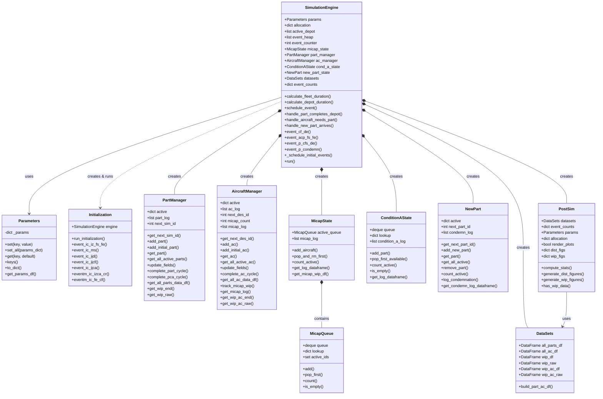

# Class Architecture

**[Download PDF to see Mermaid diagrams](https://github.com/1Ramirez7/draft_des/raw/main/docs/uml-classes.pdf)**
 
This document describes the class structure of the simulation system.

## Method Naming Conventions

Method names use abbreviations for stages and events:

| Abbreviation | Meaning |
|--------------|---------|
| `IC` | Initial Condition (initialization phase) |
| `IZ` | Initialize |
| `FS` | Fleet Start |
| `FE` | Fleet End |
| `CF` | Condition F |
| `CFS` / `CFE` | Condition F Start / End |
| `DE` | Depot End |
| `DS` | Depot Start |
| `CA` / `CAS` / `CAE` | Condition A / Start / End |
| `MS` / `ME` | MICAP Start / End |
| `IE` | Install End |
| `CR` | Cycle Restart |
| `Ij` | Inject (add initial parts/aircraft) |
| `DMR` | Depot MICAP Resolve |
| `NMR` | New Part MICAP Resolve |
| `NP` | New Part |

**Example:** `event_ic_iz_fs_fe` = Initial Condition, Initialize, Fleet Start to Fleet End

## UML Class Diagram

## Class Responsibilities

### Core Classes

| Class | File | Purpose |
|-------|------|---------|
| `SimulationEngine` | `simulation_engine.py` | Main simulation loop, event processing, coordination |
| `Parameters` | `parameters.py` | Centralized parameter storage with dict-style access |
| `Initialization` | `initialization.py` | Initial conditions setup (fleet start, depot injection, etc.) |
| `PostSim` | `post_sim.py` | Post-simulation statistics and figure generation |
| `DataSets` | `ds/data_science.py` | Output data storage (DataFrames for export) |

### Entity Managers (O(1) Dictionary Lookups)

| Class | File | Purpose |
|-------|------|---------|
| `PartManager` | `entity_part.py` | Track active parts, log completed cycles |
| `AircraftManager` | `entity_ac.py` | Track active aircraft, log completed cycles |

### State Managers (Queue-based)

| Class | File | Purpose |
|-------|------|---------|
| `MicapState` | `ph_micap.py` | MICAP queue (FIFO), aircraft waiting for parts |
| `MicapQueue` | `ph_micap.py` | Internal queue implementation for MicapState |
| `ConditionAState` | `ph_cda.py` | Available parts inventory (FIFO) |
| `NewPart` | `ph_new_part.py` | Condemned part replacement tracking |

## Method Explanations

### SimulationEngine Methods

| Method | Purpose |
|--------|---------|
| `calculate_fleet_duration()` | Draw random fleet stage duration (Normal or Weibull) |
| `calculate_depot_duration()` | Draw random depot repair duration (Normal or Weibull) |
| `schedule_event(time, type, id)` | Add event to priority queue (heap) |
| `handle_part_completes_depot(sim_id)` | Part finishes depot: check MICAP or go to Condition A |
| `handle_aircraft_needs_part(des_id)` | Aircraft needs part: take from CA or enter MICAP |
| `handle_new_part_arrives(part_id)` | New part arrives: check MICAP or go to Condition A |
| `event_cf_de(sim_id)` | Condition F to Depot End (schedules depot_complete) |
| `event_acp_fs_fe(...)` | Aircraft-Part Fleet Start to Fleet End (new cycle start) |
| `event_p_cfs_de(sim_id)` | Part Condition F Start to Depot End (depot capacity check, then condemn check) |
| `event_p_condemn(sim_id)` | Handle condemned part, order replacement |
| `_schedule_initial_events()` | Schedule all events after initialization phase |
| `run()` | Main event loop - process heap until time limit |

### Initialization Methods

| Method | Purpose |
|--------|---------|
| `run_initialization()` | Orchestrate all initialization steps |
| `event_ic_iz_fs_fe()` | Initialize parts/aircraft in Fleet (paired 1:1) |
| `event_ic_ms()` | Inject aircraft starting in MICAP status |
| `event_ic_ijd()` | Inject parts starting in Depot |
| `event_ic_ijcf()` | Inject parts starting in Condition F |
| `event_ic_ijca()` | Inject parts starting in Condition A |
| `eventm_ic_izca_cr()` | Resolve initial MICAP with available CA parts |
| `eventm_ic_fe_cf()` | Handle initial fleet_end to condition_f transitions |

## Output DataFrames

| DataFrame | Description |
|-----------|-------------|
| `all_parts_df` | Complete part event log (all cycles, all stages) |
| `all_ac_df` | Complete aircraft event log (all cycles) |
| `wip_df` | Work-in-progress snapshots (parts by stage over time) |
| `wip_raw` | Raw WIP data before aggregation |
| `wip_ac_df` | Aircraft WIP snapshots over time |
| `wip_ac_raw` | Raw aircraft WIP data |

## Key Design Patterns

### Dictionary-based Entity Tracking
Both `PartManager` and `AircraftManager` use dictionaries keyed by ID (`sim_id`, `des_id`) for O(1) lookups.

### Queue-based State Management
`MicapState` and `ConditionAState` use `deque` + `dict` combinations for:
- FIFO ordering (chronological processing)
- O(1) lookups by ID
- Event logging for debugging

### Event-Driven Architecture
The simulation uses a priority queue (heap) to process events chronologically:
- Events scheduled with `(time, counter, event_type, entity_id)`
- Counter ensures FIFO for same-time events
- Each handler schedules future events

### Composition Pattern
`SimulationEngine` creates and owns all manager classes:
- Creates `PartManager`, `AircraftManager`, `MicapState`, `ConditionAState`, `NewPart`, `DataSets` in `__init__`
- Creates `Initialization` in `run()` and passes `self` reference
- Managers don't know about each other - engine coordinates
